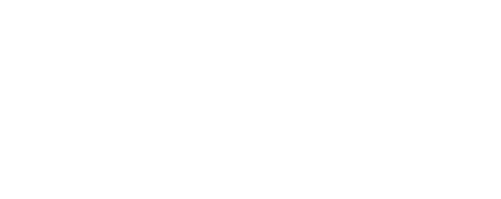

<div align="center">

<picture style="width:35%">
  <source style="width:35%" media="(prefers-color-scheme: dark)" srcset="resources/jask-white.png">
  <source style="width:35%" media="(prefers-color-scheme: light)" srcset="resources/jask-dark.png">
  
</picture>
<br><br>

**A Library for Generating Questions about Learners' Code in Java**

[What is Jask?](#what-is-jask) •
[Question Types](#question-types) •
[Examples](#examples)

</div>

<br><br>

## ⓘ What is Jask?

**Jask** is a library for generating 
[Questions about Learners' Code](http://urn.fi/URN:ISBN:978-952-64-1768-4) (QLCs) targeting Java
code. Jask aims to reframe [previous work on QLCs](https://doi.org/10.1145/3502718.3524761) as
a library which can be integrated into existing educational programming environments
to promote program comprehension.

Jask provides **question templates** which can be applied to snippets of Java code to generate
concrete **questions** targeting that code.

<br>

## 🤔 Question Types

### Structural (`pt.iscte.jask.templates.structural`)

**Structural** QLCs target structural/static aspects of code.

### Dynamic (`pt.iscte.jask.templates.dynamic`)

**Dynamic** QLCs target dynamic aspects of the code's execution.

### Quality (`pt.iscte.jask.templates.quality`)

Quality QLCs target anti-patterns and code refactor opportunities. The aim of these QLCs is to provide students with an
an opportunity to reflect about how the quality of their code could be improved.

### Errors (`pt.iscte.jask.errors`)

**Error** QLCs target compiler and runtime errors. The aim of these QLCs is to provide students with an opportunity
to reflect critically about their code's errors.


<br>

## 👉 Examples

### Structural QLC

```kotlin
val src = """
    class Test {
        static double average(int a, int b) {
            double n = 2.0;
            return (a + b) / n;
        }           
    }
"""

val qlc = HowManyVariables().generate(src)
println(qlc)
```
```
How many variables (not including parameters) does the function [average] have?
--------------------------------------
static double average(int a, int b) {
    double n = 2.0;
    return (a + b) / n;
}    
--------------------------------------
[ ] 2
[ ] 3
[x] 1
[ ] 4
```

### Dynamic QLC

```kotlin
val src = """
    class Test {
        static double abs(double n) {
            if (n < 0)
                return -n;
            else
                return n;
        }
    }
""".trimIndent()

val qlc = WhichReturnExecuted().generate(src, ProcedureCall(
    id = "abs",
    arguments = listOf(-2.0)
))
```
```
Which return statement (line) executed when calling [abs(-2.0)]?
------------------------------
static double abs(double n) {
    if (n < 0)
        return -n;
    else
        return n;
}
------------------------------
[x] Line 4
[ ] Line 7
```

### Runtime Error QLC

Runtime error QLCs rely on the [**Strudel**](https://github.com/andre-santos-pt/strudel) library to execute code in a special virtual machine
which detects runtime errors and generates QLCs.

```kotlin
val src = """
    class ArrayUtils {
        static int sum(int[] a) {
            int s = 0;
            for (int i = 0; i <= a.length; i++)
                s += a[i];
            return s;
        }
    }
""".trimIndent()

val module = Java2Strudel().load(src)

val vm = IVirtualMachine.create()

val sum = module.getProcedure("sum") as IProcedure
val array = vm.allocateArrayOf(INT, 1, 2, 3, 4, 5)

val (result, questions) = QLCVirtualMachine(vm).execute(sum, array)

questions.forEach {
    println(it)
}
```
```
The function call [sum([1, 2, 3, 4, 5])] threw an ArrayIndexOutOfBounds 
exception at line 4: the index [5] is invalid for the array [a].
------------------------------------------
static int sum(int[] a) {
    int s = 0;
    for (int i = 0; i <= a.length; i++) {
        s = s + a[i];
    }
    return s;
}
------------------------------------------

Which is the length of the array [a]?
[ ] 4
[ ] 0
[ ] 6
[x] 5

Which is the last valid index of the array [a]?
[ ] 3
[ ] 5
[x] 4
[ ] 0

Which variable is being used to access the array [a]?
[ ] s
[x] i
[ ] a
[ ] None of the above.

Which is the sequence of values taken by the variable [i] 
when calling [sum([1, 2, 3, 4, 5])]?
[x] 0, 1, 2, 3, 4, 5
[ ] 1, 2, 3, 4, 5
[ ] 1, 3, 6, 10, 15
[ ] 0, 1, 2, 3, 4
```

<br>

## 🔠 Translating Jask

Jask provides a [localisation module](src/main/kotlin/pt/iscte/jask/Localisation.kt) which allows developers to 
translate the content of questions into any language. The localisation module relies on language files present in
the [resources](src/main/resources/localisation) folder. 

Each language files contains a set of key-value pairs corresponding to the different localisabe elements
in Jask. In the translations `%s` is used to denote a value that will be filled in (automatically!) by Jask
when using that translation.

If you want to add a new language and make it available in Jask, feel free to make a pull request with your
own language files! You can add these to the `init`block of the initialisation module. Otherwise, a language
can be loaded from any `.properties` file using `Localisation.register(File("path/to/file.properties"))`.

<br>

## 📝 Publications Using Jask
- [Jask: Generation of Questions About Learners' Code in Java](https://dl.acm.org/doi/10.1145/3502718.3524761)

- Integrating Questions About Learners’ Code Into an Automated Assessment System _(coming soon!)_

<br>

## © Credit

- **Supervision:** [André L. Santos](https://ciencia.iscte-iul.pt/authors/andre-leal-santos/cv)
- **Structural, Dynamic, and Error QLCs:** [Afonso B. Caniço](https://ciencia.iscte-iul.pt/authors/afonso-canico/cv)
- **Quality QLCs:** [Gonçalo Serrano](https://www.linkedin.com/in/gon%C3%A7alo-serrano-207574232/)